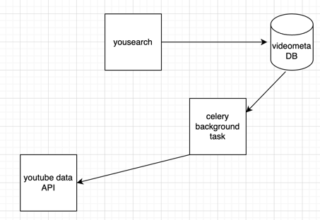

# YouSearch

__Goal__ : To create an API to fetch latest videos descending order of the time in which they were published on youtube


## Requirements

- [x] Server should call youtube API continuously in background after certain interval for a predefined search query

- [x] Store the response in DB with following fields - Video Title, Description, Publishing datetime, thumbnails URL, Channel name(Optional)

- [x] GET API to fetch data from DB in descending order
- [x] Search API to search the stored videos using their __title__ and their __description__
- [x] Dockerize the project
- [x] Should be scalable and optimised

> [!Tip] 
> ## Bonus points

- [] Add support for supplying multiple API keys so that if quota is exhausted on one, it automatically uses the next available keys ( :thinking: maybe searching a list of keys in env, if at anytime there is a particular response received from YT server, update the API_KEY env variable)
- [] Make a dashboard to see the stored videos with filter
- [] Search with partial keywords


## Implementation Choices

predefined_query = `NBA`, `Basketball`, `Vim`


### Tech Stack

- Backend:
    - fastAPI for APIs
    - postgreSQL for DB
        - Not good for concurrent operations like read & write together
        - Going with __PostgreSQL__ instead [MVCC](https://www.postgresql.org/docs/7.1/mvcc.html)
    - celery for task queue to fetch record and enter in the DB

Methods:
- 4 Docker Containers:
    One for Backend server
    One for background worker
    One for DB, One more for redis(although not used explicity in the project)

- 1 Docker container (Not a recommended solution):
    One Pod for one service was what I went with so didn't select this option
    DB, Backend service and Background worker all are in same container


### Installation

- Set your `API_KEY` in `.env` file in `app` directory
- Follow below steps
```shell
docker-compose up --build
```

By default, backend server will start on `3000` port. so visiting 
http://localhost:8000/get-latest-videos will give you the latest videos

If for any reason you face a db connection error/migration error.

follow the below steps

```shell
docker container ls
```
Using above command get the container id,

```shell
docker exec -it <container-id> /bin/bash
cd app
alembic revision --autogenerate -m "create_videometadata_table"
alembic upgrade head
```

Above commands will create the new table, if it was already not created

curl for `search-query`:

```shell
curl -X 'GET' \
  'http://localhost:8000/search/?title=lo-fi&description=lo-fi&skip=0&limit=10' \
  -H 'accept: application/json'
```

curl for `get-latest-videos`:

```shell
curl -X 'GET' \
  'http://localhost:8000/get-latest-videos?skip=0&limit=10' \
  -H 'accept: application/json'
```

> [!Note]
> ### Scalability

Project is scalable because it is using `celery` to do the background task of syncing the DB
It is also dockerized so if the load increases on one container, more can be spin-up with any orchestration tool
DB used is `PostgreSQL` because of its non-blocking I/O features unlike `SQLite` which only supports file based transactions.
PostgreSQL on the other hand provides MVCC(multi-versin concurrency control)[link](https://www.postgresql.org/docs/7.1/mvcc.html)

### Takeaways

> [!Tip]
> Learnt the importance of `-B` flag for `celery -A <task-name> worker`
It is very important to enable celery beat which can run periodically.
Reference: [Yt Video](https://youtu.be/BR8RXQRpl7U?si=s37xqrDXMu0i4tx3)

> [!Tip]
> ### Architecture
> This looks linear in diagram but process are async
> 

### References


[Youtube API Data](https://developers.google.com/youtube/v3/docs/search/list?apix=true&apix_params=%7B%22part%22:%5B%22snippet%22%5D,%22q%22:%22NBA%22%7D)


